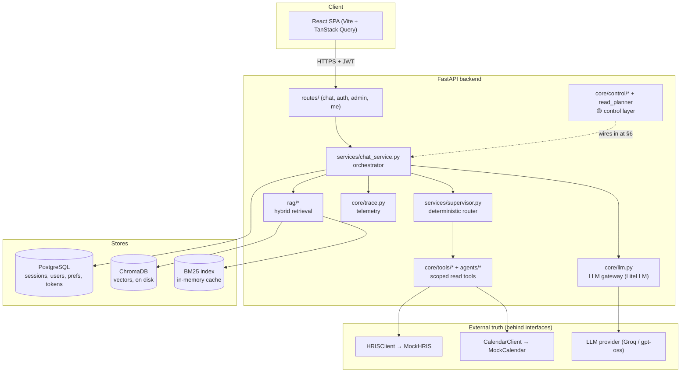
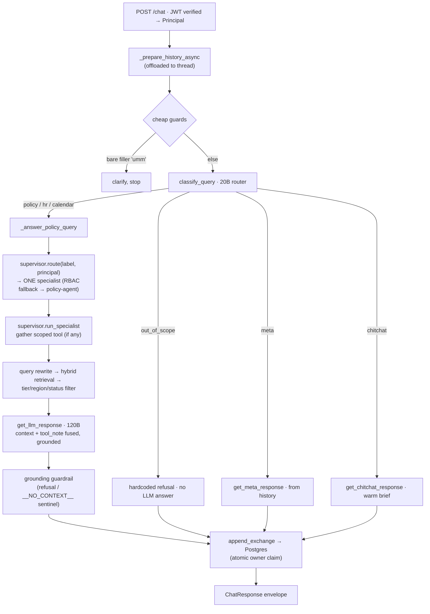
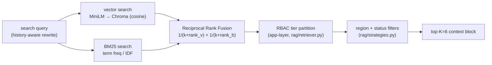
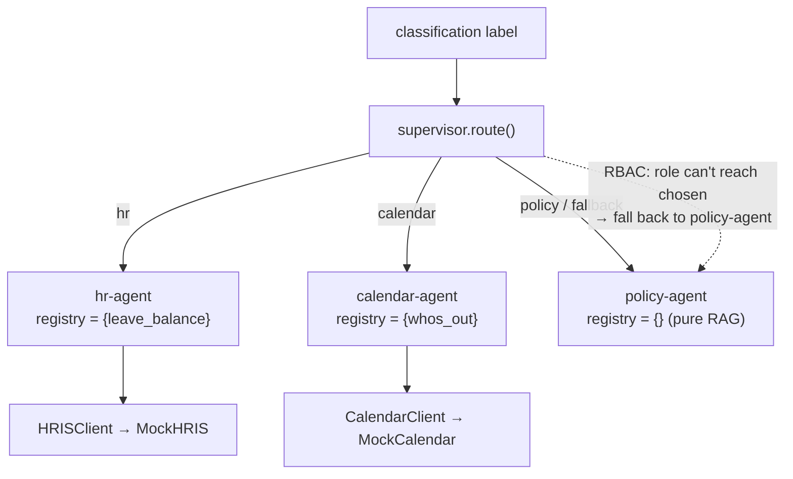
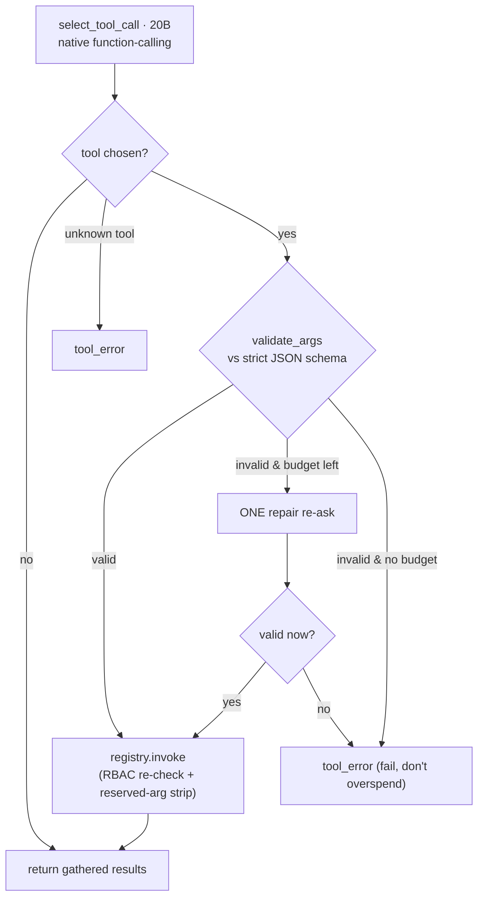
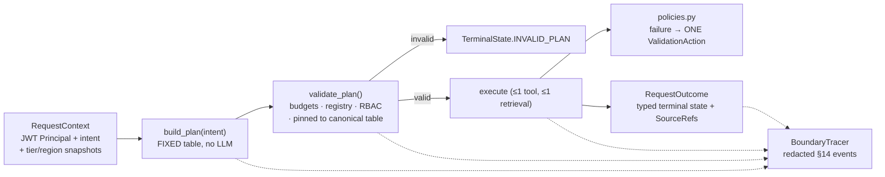
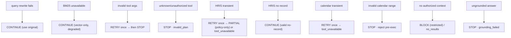
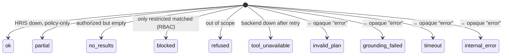
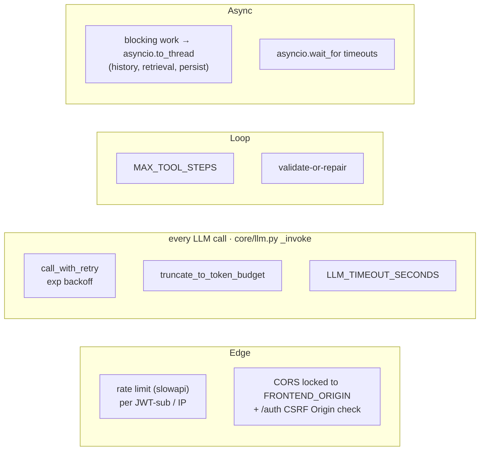
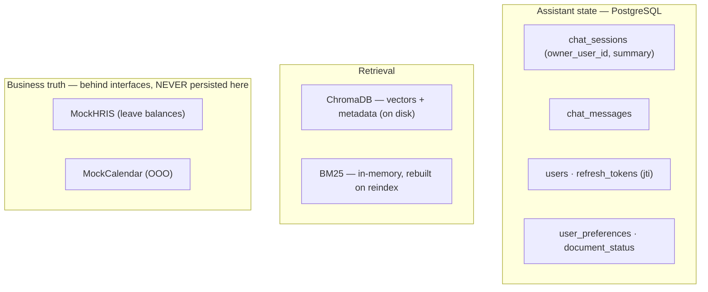

# Architecture & Request Flow

> A controlled, traceable, **read-only** multi-specialist company assistant.
> Employees ask about company policy, their own leave balance, or who's out of
> office; the system answers from authorized documents + live reads, grounded and
> cited, and every decision on the path is deterministic, bounded, and traceable.

This document is the map a new engineer (or an interviewer) reads first. It describes
the **current** architecture and the **live request flow**, names the design
trade-offs, and is honest about what is built-and-wired vs built-but-not-yet-wired.

**Status legend used throughout:**
`🟢 LIVE` — on the request path today · `🟡 BUILT, NOT WIRED` — merged + tested in isolation, the executor doesn't call it yet (lands in §6) · `⚪ PLANNED`.

---

## 1. What this is, in one breath

An **intelligent Python middleware layer**. It owns the assistant's *own* state
(users, auth, chat sessions, preferences, ingestion status) and **never** the
business's truth. The LLM does exactly three things: **decide which tool to call**,
**read policy docs (RAG)**, and **generate the reply**. Every source of truth and
every control decision (permissions, budgets, retries, failure handling) lives in
deterministic Python or in the systems a company already runs (HRIS, Calendar).

| We own (assistant state) | External systems own (business truth) |
|---|---|
| users / auth / JWT identity | leave balances → `HRISClient` (mock v1) |
| chat sessions + rolling memory | who's out of office → `CalendarClient` (mock v1) |
| preferences, doc-ingestion status | company policy = the document corpus |

**Consequence:** no business data is ever fused into the chat/RAG schema. A tool
reads an external system through an interface and forgets the value after the request.

---

## 2. System at a glance



**Tech stack:** FastAPI · React · LiteLLM (model-agnostic gateway) · ChromaDB (cosine)
· BM25 (`rank-bm25`) · sentence-transformers (`all-MiniLM-L6-v2`, local, 384-dim) ·
PostgreSQL (`psycopg3`) · pypdf + LangChain splitter for ingestion.

**Models (swappable via env):**
- **Large — `MODEL_NAME` = `groq/openai/gpt-oss-120b`** — the grounded answer + summarization.
- **Small — `ROUTER_MODEL_NAME` = `groq/openai/gpt-oss-20b`** — classification, query rewriting, and tool selection (`AGENT_READ_MODEL` defaults to the router).

> **Why two models?** Routing/extraction must be fast and cheap and run on every
> message; the expensive 120B is reserved for the one call that needs reasoning — the
> final grounded answer. Validity comes from **native function-calling + strict JSON
> schemas + validate-or-repair**, not from model size.

---

## 3. The live request lifecycle 🟢

`POST /chat` (sync) and `POST /chat/stream` (SSE) run the **same** orchestration; only
final delivery differs. Entry point: `services/chat_service.py`
(`generate_chat_reply` / `stream_chat_reply`).



### Classification — the six lanes (`core/llm.py: classify_query`, 20B)

| Label | Meaning | Path |
|---|---|---|
| `policy` | wants info from policy docs | Policy-agent → pure RAG |
| `hr` | wants **their own** live HR data ("leaves left?") | HR-agent → `leave_balance` + policy citation |
| `calendar` | wants the live **team** OOO list ("who's out?") | Calendar-agent → `whos_out` |
| `meta` | about the conversation ("what did you just say?") | answered from history, no RAG |
| `chitchat` | greeting / about Aria | brief reply, no RAG |
| `out_of_scope` | unrelated / "write me an email" | hardcoded refusal, no answer-model call |

An unknown/malformed classifier response normalizes to `policy` (fail-toward-grounded).

### Retrieval — hybrid + RRF (`rag/`)



- **Hybrid** beats either alone: vector covers semantic paraphrase, BM25 covers exact
  terms; RRF rewards chunks strong in both.
- **Security-critical ordering:** the **tier partition happens in app code before**
  restricted chunk text is ever formatted for the LLM — a blocked chunk's text never
  reaches the model. Region (`global` + caller's home) and `status` (`superseded`
  excluded) are Chroma/BM25 `where` filters. All threaded from the JWT: route → service
  → retriever.

---

## 4. Agents & orchestration 🟢

**Hierarchical, hand-rolled, bounded.** One deterministic **supervisor** delegates to
**exactly one specialist**, gets a structured result, and continues. No parallel
fan-out, no agent-to-agent delegation, no shared mutable state, no LangGraph. Each
specialist = the Unit-1 agent loop parameterized with a **scoped tool registry** + an
**RBAC floor**.



**The isolation guarantee** (`core/agents/build.py` — the single composition root):
each specialist's registry holds **only its own tool**, never a superset. Concretely
— a calendar request can *never* reach the HRIS read, and an HR request can *never*
reach the calendar read. This is what the plan validator and registry RBAC both
assume; the composition root is where it's enforced, and a regression test asserts
`hr-agent.registry.get("whos_out") is None`.

**Supervisor contract** (`services/supervisor.py`):
- `route(label, principal)` — label → one specialist; **RBAC fallback** to policy-agent
  if the caller's role can't reach the chosen specialist (never surface a specialist
  above the caller's role).
- `run_specialist(...)` — runs the scoped registry through the gather loop; **best-effort**:
  flag off / no tools / no visible specs / any gather failure ⇒ a no-note result, so
  the request **degrades to pure RAG** rather than failing.
- `build_tool_note(...)` — folds tool outputs into a **trusted, template-built** note
  (typed server fields only, never raw external text) that the answer model may state
  as fact.

**The kill switch:** `AGENT_TOOLS_ENABLED` (default **false**). Off ⇒ the tool path is
inert and behavior is **byte-identical to pure RAG** — the regression guard for the
whole agentic layer.

---

## 5. The bounded agent loop 🟢

`services/agent_loop.py: run_agent_loop(...)`. Read tools run in `gather_only` mode —
select → validate → (one repair) → invoke → return the typed result to the supervisor.



Bounds that make it safe regardless of what the model emits:
- **`MAX_TOOL_STEPS` = 3** — hard loop cap on cost/latency.
- **Validate-or-repair** — a schema-invalid call gets exactly **one** repair re-ask,
  then hard-errors. An unvalidated call **never executes**.
- **Selector-call budget** — repairs count against the budget, so a repair storm can't
  bypass the cap.

---

## 6. The control layer 🟡 (`core/control/*` + `services/read_planner.py`)

Built and tested in isolation; **the executor doesn't call it yet** (wires in at §6 of
the rescope). This is the deterministic spine that will replace the ad-hoc
`classify → route → gather → answer` with a typed, validated, traceable pipeline.



### 6.1 The fixed plan table (`read_planner.build_plan`) — canonical §7

Plans are built in **pure Python**, never by an LLM. If the model could widen a budget
or pick a specialist, a prompt injection could escalate a read into a broader action.

| Intent | Specialist | Tools | Retrieval | Budget |
|---|---|---|---|---|
| `policy` | `policy-agent` | — | required | 1 retrieval |
| `hr` | `hr-agent` | `leave_balance` | required | 1 tool + 1 retrieval |
| `calendar` | `calendar-agent` | `whos_out` | optional | 1 tool |
| `meta` / `chitchat` | — | — | none | 1 answer call |
| `out_of_scope` | — | — | none | no answer call |

`validate_plan` rejects a plan that: mismatches the plan version; exceeds the global
caps (≤1 tool, ≤1 retrieval); is internally inconsistent; names an unknown/unreachable
specialist or a tool outside its registry; **or diverges from the canonical table for
its intent** (`plan_off_table`) — so `build_plan` is the *only* source of a valid plan.

### 6.2 Deterministic failure policies (`core/control/policies.py`) — canonical §13

Every failure maps to **exactly one** `ValidationAction` — no LLM chooses recovery.
Retry-once is a property of the code (via a passed attempt count), not the caller.



### 6.3 Terminal states (`TerminalState`) & the client contract

Every request ends in exactly one of ten internal states; the outcome maps to a small
client-facing envelope status so the UI never learns the internal failure taxonomy:



Client envelope statuses: `ok · partial · no_results · blocked · refused ·
tool_unavailable` (the last four internal states collapse to a single opaque `error`).

### 6.4 Boundary tracing (`core/control/tracing.py`) — canonical §14

`BoundaryTracer` emits one **redacted** structured event per transition
(`request_received → … → request_completed / request_failed`). Redaction is the whole
point: every payload comes from an allowlisted `to_trace_record()` or a safe scalar, so
**no raw message, answer text, document body, live payload, email, or unscrubbed id**
ever reaches a trace. `answer_completed` carries latency + source count, never the
answer. Reuses the existing telemetry sink + `TELEMETRY_ENABLED` kill switch.

---

## 7. Harness engineering — resilience, retries, budgets

The "make it not fall over" layer. Each control maps to a concrete threat.



| Concern | Mechanism | Where | Default |
|---|---|---|---|
| Transient provider errors | retry + exponential backoff | `call_with_retry` | `LLM_MAX_RETRIES=2`, base `0.5s` |
| Context overflow | token-budget truncation before the call | `truncate_to_token_budget` | `LLM_CONTEXT_TOKEN_BUDGET=6000` |
| Slow provider | per-call timeout | `_invoke` / `wait_for` | `LLM_TIMEOUT_SECONDS=45` |
| Runaway tool loop | hard step cap | `run_agent_loop` | `MAX_TOOL_STEPS=3` |
| Bad tool args | one repair, then fail | `agent_loop` + `validate_args` | 1 repair |
| Long sessions | summarize + prune older turns | `chat_service` / `chat_memory` | `MAX_HISTORY_TOKENS=2000`, keep last 4 |
| Event-loop starvation | offload blocking calls to threads | `_run_blocking`, `_prepare_history_async` | — |
| Abuse / budget | per-user/IP edge rate limits | `core/ratelimit.py` | `30/min` chat |
| Tool failure | best-effort gather → degrade to pure RAG | `run_specialist` | — |

> **Degradation philosophy:** the request should get *quieter*, not *break*. A failed
> rewrite → original query. A failed BM25 → vector-only. A failed tool gather → pure
> RAG. A down HRIS → policy-only partial. Only an unrecoverable/authorization failure
> stops the request.

---

## 8. Security invariants (never weaken these)

- **Identity from the JWT only.** Tools receive a server-built `Principal`; any
  `user_id`/`email` in LLM-generated args is stripped and ignored. Bob's question can
  never read Alice's balance.
- **Tier partition before formatting.** Restricted chunk text is filtered in app code
  before it's ever put in a prompt. Postgres has no RLS — this app-layer gate is the boundary.
- **Tool RBAC twice.** Checked when *exposing* schemas (`specs_for`) and when *invoking*
  (`registry.invoke`), by `min_role`.
- **No write tools registered anywhere.** A definition-of-done invariant for the read-only rescope.
- **Prompt injection is defense-in-depth.** System-prompt integrity rules + a per-request
  **nonced** context fence + integrity preamble on every LLM route. Document/chat text
  can *request* but never *authorize* a tool call.
- **SQL always parameterized.** `psycopg` `%s`, never string interpolation.
- **Object-level authz (IDOR closed).** Every session route is ownership-checked; atomic
  owner-claim on first write.
- **Trace redaction.** Telemetry logs ids + scores + codes, never document bodies,
  emails, JWTs, or raw external payloads; ids pseudonymizable in prod.

---

## 9. Data & storage ownership



**Known tension (the serverless blocker):** on-disk Chroma, in-memory BM25, and the
~90MB local embedding model all assume a long-lived process with a stable disk — the
opposite of stateless, scale-to-zero Cloud Run. Hosting forces the move to **pgvector**
(vectors beside memory in Postgres), rebuilt BM25, and either API embeddings or
`min-instances=1`. That migration is the prerequisite for deploy.

---

## 10. Transports & the response envelope

Both transports produce the same shape; SSE streams it as events.

```
POST /chat         → { answer, sources[], latency_ms, session_id, status }
POST /chat/stream  → SSE: token* → sources → done (same envelope) | error
```

Errors everywhere use `{ "error": { code, message, detail } }`. `sources` carry
`document_id · file · section · source_type` (never a filesystem path). Status ∈
`ok | partial | no_results | blocked | refused | tool_unavailable`.

---

## 11. Configuration knobs (env, with defaults)

| Var | Default | Purpose |
|---|---|---|
| `MODEL_NAME` | `groq/openai/gpt-oss-120b` | large answer model |
| `ROUTER_MODEL_NAME` | `groq/openai/gpt-oss-20b` | classify / rewrite / tool-select |
| `AGENT_TOOLS_ENABLED` | `false` | master switch for the tool path (off = pure RAG) |
| `AGENT_READ_MODEL` | = router | model that selects/extracts tool calls |
| `MAX_TOOL_STEPS` | `3` | agent-loop cap |
| `RETRIEVAL_STRATEGY` / `RETRIEVAL_TOP_K` | `hybrid` / `6` | retrieval |
| `LLM_MAX_RETRIES` / `LLM_RETRY_BASE_DELAY` | `2` / `0.5s` | transient-error backoff |
| `LLM_TIMEOUT_SECONDS` / `LLM_CONTEXT_TOKEN_BUDGET` | `45` / `6000` | per-call bounds |
| `MAX_HISTORY_TOKENS` | `2000` | summarize-and-prune threshold |
| `JWT_SECRET` | *(required)* | server refuses to boot without it |
| `FRONTEND_ORIGIN` | `http://localhost:5173` | CORS + CSRF origin |
| `TELEMETRY_ENABLED` | `true` | boundary/span trace kill switch |

---

## 12. Where the code lives

```
backend/
  routes/        thin HTTP layer (chat · auth · admin · me)
  services/
    chat_service.py   orchestrator (history → classify → route → gather → answer → persist)
    supervisor.py     deterministic route() + run_specialist() + build_tool_note()
    read_planner.py   🟡 build_plan() fixed table + validate_plan()
    agent_loop.py     bounded run_agent_loop (validate-or-repair, gather_only)
  core/
    llm.py            LLM gateway: classify / answer / stream / select_tool_call; retry + truncate
    control/          🟡 models · policies · tracing  (typed plans, failure map, boundary traces)
    tools/            Principal · ToolRegistry (RBAC) · leave_balance · whos_out
    agents/           Specialist value objects + build_specialists() (scoped registries)
    hris/  calendar/  external-truth interfaces + seeded mocks
    trace.py          request-scoped trace_id + LLM spans + request rollup
    auth · tokens · chat_memory · preferences · ratelimit · errors
  rag/                loaders · chunking · embedding · vector_store · bm25 · strategies · retriever
```

---

## 13. Honest status (as of 2026-07-07, branch `control-layer`)

- 🟢 **Live:** auth + RBAC · hybrid RAG with tier/region/status filtering · supervisor +
  three isolated specialists · bounded agent loop · retries/timeouts/budgets ·
  observability spans · React frontend. Tool path gated behind `AGENT_TOOLS_ENABLED`.
- 🟡 **Built, not wired:** the §4 control layer (typed plans, `validate_plan`,
  deterministic failure policies, boundary tracer). It is fully unit-tested but the
  executor doesn't call it yet — **§6 is the integration** that makes it the live path
  and collapses sync/stream into one shared pipeline.
- ⚪ **Planned (must-ship order):** pgvector cutover + Cloud Run deploy · durable
  ingestion jobs · evidence viewer · committed evaluation metrics.

**Deliberately out of scope (need a new written decision):** any write tool
(leave requests, calendar events), confirmation gates, Slack/Jira/GitHub, parallel
fan-out, LLM-chosen plans/budgets, LLM judges, long-term semantic memory.

> **One-line self-summary:** a bounded read-only multi-specialist assistant whose
> routing, permissions, evidence, failures, recovery actions, and (soon) full request
> trace are explicit, testable, and deterministic — the LLM decides *what to read* and
> *how to phrase*, and nothing else.
