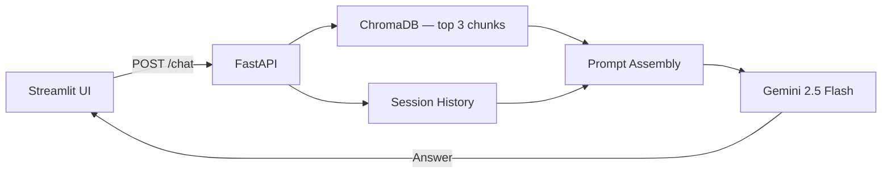
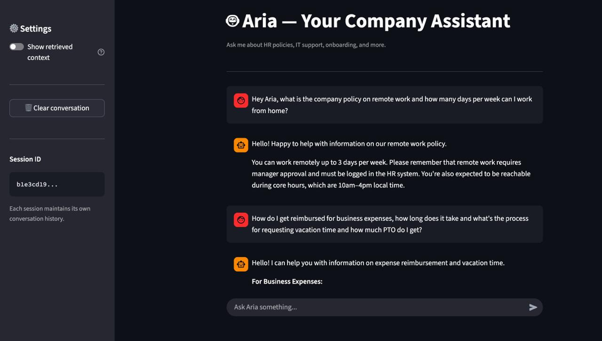
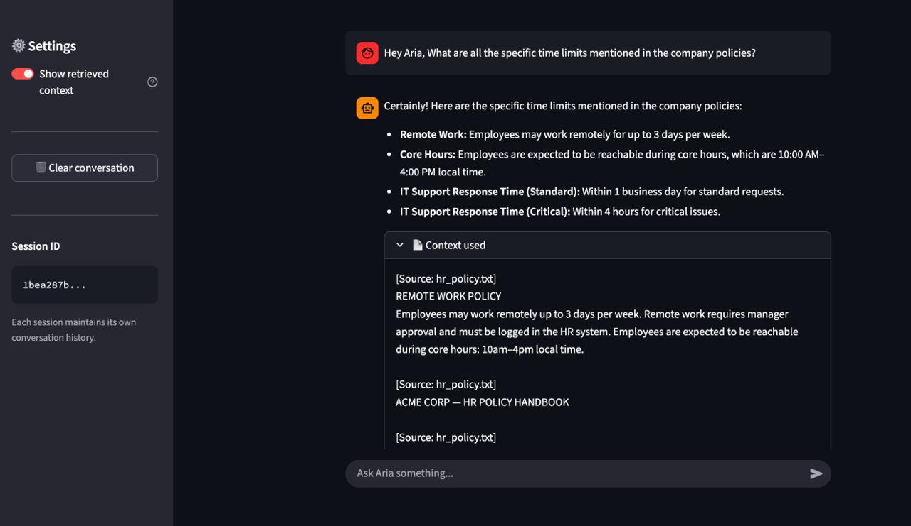

# Aria — Internal Company AI Assistant

AI-powered internal chatbot using Retrieval-Augmented Generation (RAG). 
Employees ask questions about HR, IT, and company policies and get answers 
grounded in real company documents — not LLM guesswork.

---

## Project Direction

Evolve from a document focused RAG assistant into a **hybrid AI work assistant**.  
Alongside grounded policy Q&A, the system is being extended to support **structured data analysis, basic visualizations, and tool-driven workflows** while preserving the current reliable RAG foundation.

**Near-term focus:**
- Add lightweight analytics capability
- Enable chart generation from business datasets
- Keep the architecture modular and production-ready

---

## Tech Stack

| Component | Technology |
|-----------|------------|
| LLM | Gemini 2.5 Flash |
| Backend | FastAPI |
| Vector DB | ChromaDB |
| Embeddings | Sentence Transformers (`all-MiniLM-L6-v2`) |
| Frontend | Streamlit |

---

## Project Structure
```
company-chatbot/
├── backend/
│   ├── main.py              # FastAPI entry point, triggers indexing on startup
│   ├── core/
│   │   ├── config.py        # Environment variable loading
│   │   ├── gemini.py        # Gemini client, prompt building, conversation history
│   │   └── rag.py           # Document chunking, ChromaDB indexing and retrieval
│   ├── routes/
│   │   └── chat.py          # /chat endpoints, session management
│   └── data/docs/           # Drop .txt company documents here
├── frontend/
│   └── app.py               # Streamlit chat UI
├── docs/
│   └── system_prompt.txt    # Bot persona and rules — no code needed
└── requirements.txt
```

---

## How It Works

**Startup:** `.txt` files in `data/docs/` are chunked, embedded via Sentence 
Transformers, and stored in ChromaDB. Already-indexed files are skipped.

**Each message:**
1. ChromaDB converts the query to an embedding, returns top 3 relevant chunks
2. Chunks + conversation history injected into Gemini prompt
3. Gemini returns a grounded, document-backed answer
4. Response saved to session history, returned to Streamlit


---

## Setup
```bash
git clone https://github.com/HardityaGhuman/aria.git
cd aria
pip install -r requirements.txt
```

Create `backend/.env`:
```ini
GEMINI_API_KEY=your_key_here
MODEL_NAME=gemini-2.5-flash-preview-04-17
DOCS_PATH=./data/docs
CHROMA_DB_PATH=./data/chroma_db
SYSTEM_PROMPT_PATH=../docs/system_prompt.txt
```
```bash
# Terminal 1
cd backend && python main.py

# Terminal 2
cd frontend && streamlit run app.py
```

- Frontend: http://localhost:8501
- API + docs: http://localhost:8000/docs

---

## Screenshots

### Chat Interface


### Response with Retrieved Context


---

## API

| Method | Endpoint | Description |
|--------|----------|-------------|
| `POST` | `/chat` | Send message, get reply + context used |
| `GET` | `/chat/history/{session_id}` | Get session history |
| `DELETE` | `/chat/history/{session_id}` | Clear session |

---

## Notes

- Add knowledge: drop `.txt` files into `backend/data/docs/` and restart
- Change persona: edit `docs/system_prompt.txt`
- Never commit `.env` or `backend/data/chroma_db/`