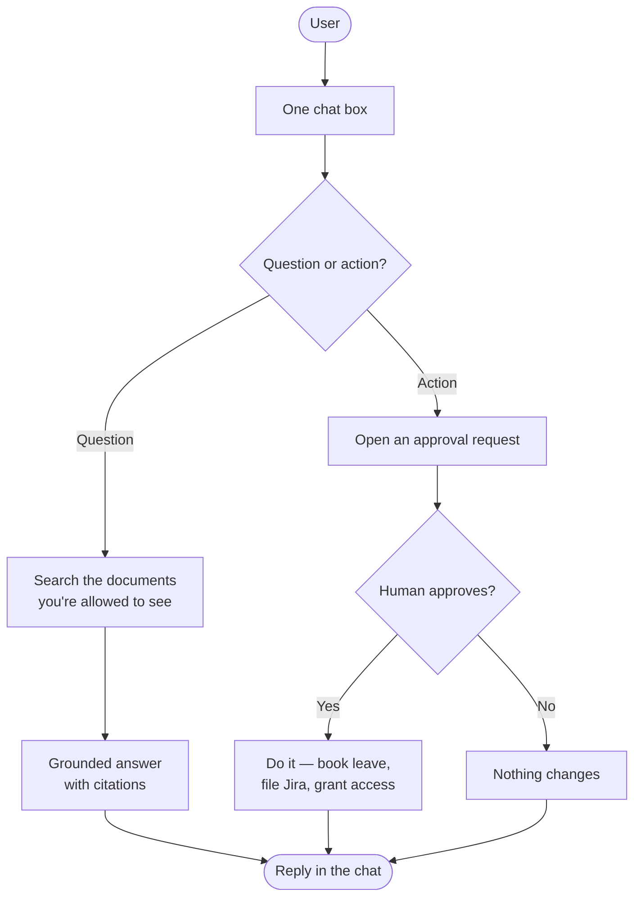

# Aria — Company Assistant

Aria is an internal company assistant you use from **one chat box**.

- **Ask** a policy question — *"How much PTO do I have left?"*, *"Who's out next week?"* —
  and it answers from the real company documents you're allowed to see, with citations.
  If it has no source or you're not cleared for the answer, it says so instead of guessing.
- **Ask it to do something** — *"Book me two days off"*, *"File a Jira for the redesign"*,
  *"Set up my access, I'm a new backend engineer"* — and it opens a request that a human
  approves right there in the chat. Nothing changes company data until someone signs off.

The chat is the whole product: questions and actions both start in the same place.

---

## What it can do

| | |
|---|---|
| 💬 **Answer from documents** | Grounded replies with citations — never made up. No source, no answer. |
| 🔒 **Respect who's asking** | You only see documents your role and region allow. |
| ✅ **Take actions, safely** | Book leave, file a Jira, grant new-hire access — each needs human approval first. |
| 🧵 **Remember the conversation** | Per-user chat sessions with rolling summaries so long chats stay cheap. |
| 📥 **Let HR manage the corpus** | Upload, delete, and re-index policy documents as a background job. |

---

## How it works

Every message goes to a small, fast router that decides whether it's a **question** or an
**action** — then hands it to the right place. Questions are answered from documents;
actions become approval-gated requests. A human is always in the loop before anything is
written, and the AI never decides *what* to do on its own — it only classifies the request
and writes the wording.


```mermaid
flowchart TB
    User([User]) --> Chat[One chat box]
    Chat --> Router{Question or action?}

    Router -->|Question| Search[Search the documents<br/>you're allowed to see]
    Search --> Answer[Grounded answer<br/>with citations]

    Router -->|Action| Request[Open an approval request]
    Request --> Gate{Human approves?}
    Gate -->|Yes| Act[Do it — book leave,<br/>file Jira, grant access]
    Gate -->|No| Skip[Nothing changes]

    Answer --> Reply([Reply in the chat])
    Act --> Reply
    Skip --> Reply
```

**Questions** are answered by combining meaning-based and keyword search over the policy
documents, filtered to what you're allowed to see, then written up by a language model that
is only allowed to use the retrieved text.

**Actions** run as tracked requests with a clear lifecycle — *submitted → waiting for
approval → done* (or *denied*). Each one survives a server restart, can't be accidentally
run twice, and keeps an audit trail. The three action types today are **Leave**, **Jira**,
and **New-hire access**.

---

## Security, in short

- **Identity comes from your login, never from the chat.** You can't act as someone else by
  asking nicely.
- **You only see what your role and region permit** — restricted text never even reaches the
  model when you're not cleared for it.
- **No action happens without human approval**, and every action is logged.

---

## Tech stack

| Layer | Choice |
|---|---|
| Backend | FastAPI (regular + streaming chat) |
| Frontend | React (Vite + TanStack Query) |
| AI gateway | LiteLLM — provider-agnostic (default Groq models) |
| Search | PostgreSQL + pgvector (semantic) and BM25 (keyword), merged |
| Embeddings | Sentence-Transformers `all-MiniLM-L6-v2` (local) |
| Action workflows | LangGraph (approval-gated, resumable) |
| Storage | PostgreSQL (app data) + AWS S3 (original files) |
| Auth | JWT + bcrypt, 3-tier role-based access + region |

The external systems Aria acts on (HR, Jira, calendar, access provisioning) are **mocked
behind clean interfaces**, so plugging in the real ones later doesn't touch the rest of the app.

---

## Run it locally

```bash
python -m venv venv && source venv/bin/activate
pip install -r requirements.txt

# PostgreSQL + pgvector
brew install postgresql@16 pgvector && brew services start postgresql@16
createdb company_chatbot

# Configuration — copy the template, set a provider key + JWT_SECRET
cp backend/.env.example backend/.env

# Seed users, build the search index once, start everything
python -m backend.seed_users
python -m backend.index_documents
./start.sh
```

- Frontend: http://localhost:5173 · API docs: http://localhost:8000/docs
- Seeded accounts (password `Test1234!`): `hr@gsvh.test`, `manager@gsvh.test`,
  `employee@gsvh.test`, `employee2@gsvh.test`

Full configuration lives in `backend/.env.example`.

---

## API at a glance

Protected routes need `Authorization: Bearer <token>`. The full typed contract is at
[`docs/api/openapi.json`](docs/api/openapi.json) (live at `/docs`).

| Group | What it covers |
|---|---|
| **Auth** | Login, refresh, logout, current user |
| **Chat** | Send a message (sync or streaming), manage sessions and history |
| **Cases** | List action requests, view one, approve or deny |
| **Admin** | HR document management; action-queue health |

---

## Status

- **Answering questions:** shipped and live.
- **Taking actions:** the backend is complete (Leave, Jira, new-hire access); the chat UI
  for approving requests is next.

Everything action-related is behind feature flags — with them off, Aria behaves exactly like
the read-only assistant.
