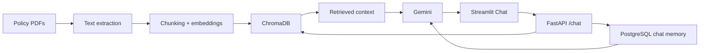

# Aria - Company Policy RAG Chatbot

Aria is a simple internal chatbot for answering employee questions from uploaded
company policy documents. It ingests PDF files, stores searchable chunks
in ChromaDB, retrieves relevant policy context, and asks Gemini to answer only
from that context.

This project is intentionally demo-friendly: no auth, no accounts, no admin
setup. Drop in policy PDFs, reindex, and ask questions.

## Tech Stack

| Component | Technology |
|-----------|------------|
| LLM | Gemini 2.5 Flash |
| Backend | FastAPI |
| Vector DB | ChromaDB |
| Chat Memory | PostgreSQL |
| Embeddings | Sentence Transformers (`all-MiniLM-L6-v2`) |
| PDF parsing | `pypdf` |
| Frontend | Streamlit |

## How It Works

1. Add `.pdf` policy files through the Streamlit sidebar or place them
   in `backend/data/docs/`.
2. Click **Reindex policies**.
3. The backend extracts text, chunks it, embeds it, and stores it in ChromaDB.
4. Conversation history is saved in PostgreSQL by Streamlit session ID.
5. Each policy question retrieves the most relevant chunks.
6. Gemini answers using the retrieved policy context plus recent session history.


```mermaid
flowchart LR
    A[Policy PDFs] --> B[Text extraction]
    B --> C[Chunking + embeddings]
    C --> D[ChromaDB]
    E[Streamlit Chat] --> F[FastAPI /chat]
    F --> D
    F --> I[PostgreSQL chat memory]
    D --> G[Retrieved context]
    I --> H[Gemini]
    G --> H[Gemini]
    H --> E
```

## Setup

```bash
pip install -r requirements.txt
```

Create a local PostgreSQL database for short-term chat memory:

```bash
# If PostgreSQL is not installed on macOS:
brew install postgresql@16
brew services start postgresql@16

createdb company_chatbot
```

Create `backend/.env`:

```ini
GEMINI_API_KEY=your_key_here
MODEL_NAME=gemini/gemini-2.5-flash
ROUTER_MODEL_NAME=gemini/gemini-2.5-flash-lite
DATABASE_URL=postgresql://localhost:5432/company_chatbot
EMBEDDING_MODEL_NAME=all-MiniLM-L6-v2
EMBEDDINGS_LOCAL_ONLY=true
RETRIEVAL_TOP_K=3
BM25_CANDIDATE_POOL=10
EXPAND_SECTION_RETRIEVAL=false
DOCS_PATH=./data/docs
CHROMA_DB_PATH=./data/chroma_db
SYSTEM_PROMPT_PATH=../docs/system_prompt.txt
```

Run the app:

```bash
# Terminal 1
cd backend
python main.py

# Terminal 2
cd frontend
streamlit run app.py
```

- Frontend: http://localhost:8501
- API docs: http://localhost:8000/docs
- Health check: http://localhost:8000/health

## Demo Flow

1. Open the Streamlit app.
2. Upload one or more company policy PDFs in the sidebar.
3. Click **Reindex policies**.
4. Ask grounded questions such as:
   - "How many days of PTO do employees get?"
   - "What is the remote work policy?"
   - "How do I request software access?"
5. Turn on **Show retrieved context** to show the RAG evidence behind the answer.
6. Ask an out-of-scope question such as "What was company revenue last year?"
   to show that the bot refuses to invent facts not present in the policies.

## API

| Method | Endpoint | Description |
|--------|----------|-------------|
| `POST` | `/chat` | Ask a question and receive an answer with context and sources |
| `POST` | `/chat/reindex` | Ingest new or changed PDF policy files |
| `GET` | `/chat/documents` | List PDF policy files available for ingestion |
| `GET` | `/chat/history/{session_id}` | Get persisted session chat history |
| `DELETE` | `/chat/history/{session_id}` | Clear persisted session chat history |

## Notes

- Changed policy files are automatically reindexed based on a content hash.
- ChromaDB and uploaded policy documents are ignored by git.
- This is a local demo app with no auth by design.
