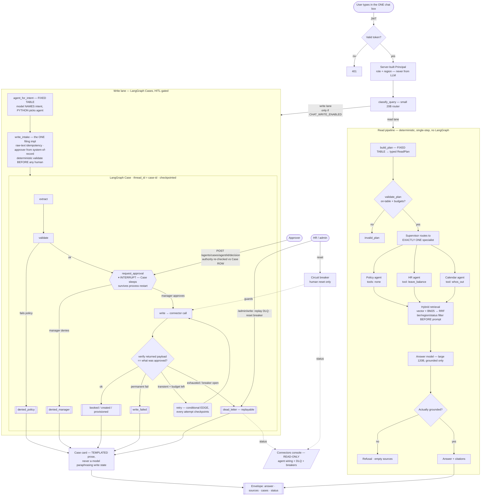
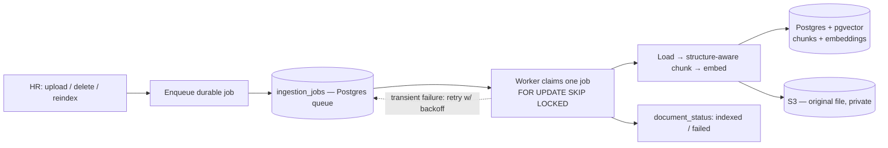

# Aria — Controlled Multi-Agent Company Assistant

Aria is a company assistant you **talk to in one chat box**. Ask a policy question
(*"how much PTO do I have left?"*, *"who's out next week?"*) and it answers **grounded
in the real documents you're allowed to see**, with citations — and if the honest
answer is "you're not cleared for that" or "I have no source," it says so instead of
inventing one. Ask it to **do** something (*"book me 2 days off next week"*, *"file a
Jira for the landing-page redesign"*, *"I'm starting as a backend engineer, set up my
access"*) and the same chat hands it to a **write agent** that opens a **gated Case**
— nothing changes company data until a human approves it, right there in the chat.

**The chat is the product.** Reads and writes both originate in the same box. Every
request is bounded, traceable, and explainable by construction — the model decides
*which* lane and writes the prose, but a deterministic control layer owns the plan,
the routing, the approval gate, and the retry/failure policy. **No LLM is ever in the
control path, and no write happens without a human's approval.**

---

## Where this is right now

**Read core: shipped and live.** A deterministic supervisor over three isolated read
specialists (Policy · HR · Calendar), RBAC + region-filtered hybrid retrieval,
grounding guardrail, redacted boundary tracing, durable ingestion, offline evaluation.
Postgres + pgvector authoritative store; originals in S3.

**Write core: backend shipped, frontend is the next slice.** Three
human-approval-gated write agents run as **LangGraph Cases** on one shared, agent-agnostic
write boundary (retry-as-a-graph-edge · circuit breaker · dead-letter queue · replay ·
verified provisioning):

| Write agent | Does | State |
|---|---|---|
| **Leave** | Book time off (decrements HRIS balance) | ✅ backend, on shared boundary |
| **Jira** | File an issue against the right project | ✅ backend, on shared boundary |
| **Onboarding / Access** | Grant a new hire's role-bundle access | ✅ backend, on shared boundary |

The **chat write lane** is wired end-to-end on the server: typing *"book me 2 days
off"* now classifies as a write intent, a fixed table picks the agent, and a gated Case
is filed and returned to the chat as a card. The **HITL approval door**
(`POST /agents/cases/{agent}/{case_id}/decision`) is agent-agnostic and re-checks the
approver against the Case row. Everything is behind kill switches
(`CHAT_WRITE_ENABLED`, per-agent `*_AGENT_ENABLED`) — **flags off ⇒ byte-identical to
the read-only assistant.**

**Next:** the frontend — chat renders Case cards with Approve/Deny, plus a **read-only
connectors console** (which agents are wired + HR's automation-health board: DLQ +
breakers). The console is a status board; the work always happens in the chat.

> **What's real vs. mocked.** The whole control spine, LangGraph Cases with
> interrupt/resume, idempotency, audit log, breaker/DLQ, RBAC retrieval, pgvector, and
> S3 are real. The *external systems of record* (HRIS leave balance, Jira, the access
> provisioner, the calendar) are **mocks behind seams** — swapping in Workday / a real
> Jira / an IdP changes nothing above the seam.

---

## The whole system, one diagram


```mermaid
flowchart TB
    U([User types in the ONE chat box]) -->|JWT| AUTH{Valid token?}
    AUTH -->|no| E401[401]
    AUTH -->|yes| P[Server-built Principal<br/>role + region — never from LLM]
    P --> CLS[classify_query — small 20B router]

    CLS -->|read lane| READ
    CLS -->|write lane<br/>only if CHAT_WRITE_ENABLED| WRITE

    subgraph READ [Read pipeline — deterministic, single-step, no LangGraph]
        direction TB
        RP[build_plan — FIXED TABLE → typed ReadPlan] --> RV{validate_plan<br/>on-table + budgets?}
        RV -->|no| RERR[invalid_plan]
        RV -->|yes| SUP[Supervisor routes to<br/>EXACTLY ONE specialist]
        SUP --> POL[Policy agent<br/>tools: none]
        SUP --> HR[HR agent<br/>tool: leave_balance]
        SUP --> CAL[Calendar agent<br/>tool: whos_out]
        POL & HR & CAL --> RET[Hybrid retrieval<br/>vector + BM25 → RRF<br/>tier/region/status filter BEFORE prompt]
        RET --> ANS[Answer model — large 120B, grounded only]
        ANS --> GUARD{Actually grounded?}
        GUARD -->|no| REF[Refusal · empty sources]
        GUARD -->|yes| OUT[Answer + citations]
    end

    subgraph WRITE [Write lane — LangGraph Cases, HITL-gated]
        direction TB
        AI[agent_for_intent — FIXED TABLE<br/>model NAMES intent, PYTHON picks agent] --> INTAKE
        INTAKE[write_intake — the ONE filing impl<br/>raw-text idempotency · approver from system-of-record<br/>deterministic validate BEFORE any human]
        INTAKE --> GRAPH

        subgraph GRAPH [LangGraph Case · thread_id = case-id · checkpointed]
            direction TB
            EX[extract] --> VA[validate]
            VA -->|fails policy| DP[[denied_policy]]
            VA -->|ok| RA{{request_approval<br/>⏸ INTERRUPT — Case sleeps<br/>survives process restart}}
            RA -->|manager denies| DM[[denied_manager]]
            RA -->|manager approves| W[write → connector call]
            W --> VER{verify returned payload<br/>== what was approved?}
            VER -->|ok| SUCC[[booked / created / provisioned]]
            VER -->|permanent fail| WF[[write_failed]]
            VER -->|transient + budget left| RETRY(retry — conditional EDGE,<br/>every attempt checkpoints)
            RETRY --> W
            VER -->|exhausted / breaker open| DL[[dead_letter — replayable]]
        end
    end

    OUT --> ENV[[Envelope: answer · sources · cases · status]]
    DP & DM & SUCC & WF & DL --> CARD[Case card — TEMPLATED prose,<br/>never a model paraphrasing write state]
    CARD --> ENV

    MGR([Approver]) -->|POST /agents/cases/agent/id/decision<br/>authority re-checked vs Case ROW| RA
    BRK[Circuit breaker<br/>human reset only] -.guards.-> W
    ADMIN([HR / admin]) -->|/admin/write: replay DLQ · reset breaker| DL
    ADMIN -->|reset| BRK

    CONSOLE[/Connectors console — READ-ONLY<br/>agent wiring + DLQ + breakers/]
    DL -.status.-> CONSOLE
    BRK -.status.-> CONSOLE
```

**How to read it.** Two lanes leave the classifier. The **read lane** is single-step
and deterministic: a fixed table builds a typed plan, it's validated against hard
budgets, one specialist runs, retrieval is RBAC-filtered *before* any text is formatted,
and the answer is refused if it isn't grounded. The **write lane** never runs inline —
it files a **Case** that runs as a LangGraph workflow, **pauses at an interrupt for
human approval**, and only then calls the connector. Retry is a graph edge (so every
attempt checkpoints), a circuit breaker only a human can clear guards the connector, and
an exhausted/tripped write lands in a **replayable dead-letter queue** instead of being
lost. `CHAT_WRITE_ENABLED=false` removes the entire right half — the classifier is never
shown the write labels and the read pipeline is byte-identical.

---

## Why it's built this way

- **The model classifies and writes prose; it never picks the plan or the agent.**
  Intent → a **fixed table** → a typed plan (read) or a chosen agent (write). A
  prompt-injected `write_jira` can still only reach the Jira agent, which still runs its
  own deterministic validator and still parks at a human gate.
- **Two models, on purpose.** A small **20B** router runs on *every* message (classify,
  rewrite the query, pick a tool) — fast and cheap. The large **120B** runs *once*, for
  the one job that needs reasoning: the grounded answer. Both are swappable by env var
  (LiteLLM) — the provider is not baked in.
- **Execution ≠ correctness.** A write is only `provisioned` after the connector's
  returned payload is **verified against what was approved**. A clean "OK" with an empty
  or partial payload is a *failure*, not a success.
- **Failure is classified, not guessed.** A write error is `transient` or `permanent`;
  **unknown ⇒ permanent, fail closed.** Transient retries within a bounded budget;
  permanent is terminal; exhausted-transient / breaker-open is a replayable dead-letter.

---

## Who sees what (RBAC + region)

Every document self-describes its `access_tier`, `region`, and `status`. Retrieval
filters on all three:

| Axis | Rule |
|---|---|
| **access_tier** | employee → `all`; manager → `all`+`manager`; HR → everything |
| **region** | `global` visible to all; `us` / `india` docs only to that region |
| **status** | `superseded` docs (last year's policy) are never surfaced |

The tier check is the security boundary. It happens **in application code, before a
restricted chunk is ever formatted into a prompt** — not as a model instruction a clever
question could talk its way past. If the only matches are above your tier, you get a
polite *"that's confidential — contact HR"*, not the numbers.

---

## The agents

**Read specialists** — one supervisor delegates to exactly one per request; no fan-out,
no specialist calling another, each reachable only from its own scoped registry.

| Specialist | Answers | Backed by |
|---|---|---|
| **Policy** | Any policy question | Document retrieval only (no tools) |
| **HR** | *Your own* leave balance, fused with policy | `HRISClient` (mock) + retrieval |
| **Calendar** | Who's out over a date range | `CalendarClient` (mock) + retrieval |

**Write agents** — each runs as a LangGraph Case on the **same** agent-agnostic write
boundary (`core/write/`): a derived lifecycle (an agent *cannot forget* `write_failed` /
`dead_letter`), retry-as-an-edge, a human-cleared breaker, a DLQ that's just a query, and
a verified success status.

| Write agent | Success status | Connector (mock) | Agent-specific verify |
|---|---|---|---|
| **Leave** | `booked` | `MockHRIS.submit_leave` | booked dates == approved dates |
| **Jira** | `created` | `MockJira` | issue key's project prefix == approved project |
| **Onboarding / Access** | `provisioned` | `MockAccessProvisioner` | granted bundle == approved bundle |

Two rules keep all of this safe:

- **Identity comes from your token, never from the question.** Tools and Cases are built
  with the *server's* idea of who you are, so Bob can never read Alice's balance — or
  file leave as her — by asking nicely. The approver comes from a system of record, never
  from the message.
- **Tools are isolated and gated twice.** Each read specialist reaches only its own tool;
  each write tool is registered only in its write registry and reachable only from the
  post-approval `write` node. Master switches (`AGENT_TOOLS_ENABLED`, per-agent
  `*_AGENT_ENABLED`, `CHAT_WRITE_ENABLED`) turn any of it off.

---

## The write Case, in words

A **Case** — not the chat message — is the unit of work: an id, a status, an owner, an
append-only audit log, checkpointed LangGraph state. Lifecycle:

`draft` → `pending_approval` (⏸ **interrupt**, sleeps awaiting a human) → **approved** →
`booked` / `created` / `provisioned` **·or·** `write_failed` **·or·** `dead_letter`
(replayable). Denials branch out early as `denied_policy` (failed the deterministic
validator) or `denied_manager`.

- **The approval survives a restart.** The Case sleeps at the interrupt; the process can
  die and the Case resumes at the exact node via `Command(resume=…)` on the same
  `thread_id`.
- **No double-writes.** Raw-text idempotency means a re-sent request is *read*, never
  re-driven onto its parked thread; a decided Case is a `409`, never a second write.
- **Dead-letter is a query, not a table.** `WHERE status = 'dead_letter'` across every
  agent — replayable by a human, who re-enters the write node over the same checkpointer.

---

## Retrieval, briefly

Two searches run in parallel and get merged:

- **Semantic** — the question is embedded (local MiniLM model) and matched by meaning
  against the pgvector index.
- **Keyword** — BM25 catches exact terms the semantic search might miss.

Their rankings are fused with **RRF** (Reciprocal Rank Fusion — "agreed-on by both lists
ranks higher"). The merged top results, *after* the role/region/status filter, become the
only evidence the answer model is allowed to use.

---

## Ingestion — how documents get in

HR uploads, deletes, or reindexes. The request returns immediately; the real work is a
**durable job** so nothing is lost if the server restarts mid-processing.


```mermaid
flowchart LR
    HR[HR: upload / delete / reindex] --> ENQ[Enqueue durable job]
    ENQ --> Q[(ingestion_jobs — Postgres queue)]
    Q --> W[Worker claims one job<br/>FOR UPDATE SKIP LOCKED]
    W --> PR[Load → structure-aware chunk → embed]
    PR --> PGV[(Postgres + pgvector<br/>chunks + embeddings)]
    PR --> S3[(S3 — original file, private)]
    W --> ST[document_status: indexed / failed]
    W -.->|transient failure: retry w/ backoff| Q
```

Durable + crash-safe (job lives in Postgres, reclaimed after lease expiry), idempotent
(re-run replaces the doc atomically), originals kept privately in S3 keyed per version,
and transient errors back off then give up cleanly as `failed`.

---

## Where data lives

The app owns everything the *assistant* needs; it never persists the *business's* truth.

| Store | Holds |
|---|---|
| **Postgres** | users · refresh tokens · chat sessions + messages · preferences · document status · **documents / document_versions / chunks** (`vector(384)`) · **ingestion_jobs** queue · **write Cases + append-only audit** · **LangGraph checkpoints** |
| **S3** | original uploaded files (private, encrypted, keyed by version) |
| **In-memory** | the BM25 keyword index — a derived cache, rebuilt from the chunk table |
| **Behind seams (never persisted)** | HRIS leave balances · calendar OOO · Jira · access provisioner |

---

## Security invariants

- **Identity from the JWT only** — any `user_id`/`email` in model output is ignored, for
  reads *and* writes.
- **Tier filter before formatting** — restricted text can't reach the model.
- **No *ungated* write path** — every write goes through a human-in-the-loop approval gate
  + idempotency + append-only audit. No autonomous/unapproved write tool exists; write
  tools are reachable only from a post-approval node.
- **Execution is verified** — a write is `provisioned` only after its returned payload is
  checked against what was approved; failure classification is fail-closed
  (unknown ⇒ permanent).
- **Prompt-injection defense in depth** — fixed system rules + a per-request nonced fence
  around retrieved text; a document can *request* a tool call but never *authorize* one.
- **SQL always parameterized**; sessions and Cases are owner/authority-checked.
- **Traces redact** — logs carry ids, scores, and codes, never document bodies, emails,
  tokens, or raw connector payloads.

---

## Tech stack

| Layer | Choice |
|---|---|
| Backend | FastAPI (sync `/chat` + SSE `/chat/stream` share one pipeline) |
| Write workflows | **LangGraph** Cases (typed state · checkpoint · interrupt/resume) |
| LLM gateway | LiteLLM — provider-agnostic (default Groq `gpt-oss-120b` / `gpt-oss-20b`) |
| Vector store | PostgreSQL + **pgvector** (cosine, HNSW index) |
| Keyword search | BM25 (`rank-bm25`), fused via RRF |
| Embeddings | Sentence-Transformers `all-MiniLM-L6-v2` (local, 384-dim) |
| Object storage | AWS S3 (originals) behind a swappable `ObjectStore` seam |
| Auth | JWT (HS256) + bcrypt; short access token + rotating refresh cookie; 3-tier RBAC + region |
| Frontend | React (Vite + TanStack Query) — chat, SSE, sessions, prefs, HR doc portal, dark mode |
| Ingestion | Durable Postgres job queue + in-process worker |

---

## Run it

```bash
python -m venv venv && source venv/bin/activate
pip install -r requirements.txt

# Postgres + pgvector
brew install postgresql@16 pgvector && brew services start postgresql@16
createdb company_chatbot

# backend/.env — copy the template, set a provider key + JWT_SECRET (+ S3 creds)
cp backend/.env.example backend/.env

# Seed users, build the index once, start everything
python -m backend.seed_users        # needs SEED_*_PASSWORD env vars
python -m backend.index_documents   # re-run when docs or chunking change
./start.sh
```

Seeded accounts (password `Test1234!`): `hr@gsvh.test` (HR, US), `manager@gsvh.test`,
`employee@gsvh.test`, `employee2@gsvh.test` (India).

- Frontend: http://localhost:5173 · API docs: http://localhost:8000/docs

**Key config** (full list in `backend/.env.example`):

| Var | Default | Purpose |
|---|---|---|
| `MODEL_NAME` | `groq/openai/gpt-oss-120b` | large answer model |
| `ROUTER_MODEL_NAME` | `groq/openai/gpt-oss-20b` | classify / rewrite / tool-select |
| `AGENT_TOOLS_ENABLED` | `false` | read-tool master switch (off = pure RAG) |
| `CHAT_WRITE_ENABLED` | `false` | chat write lane (off = read pipeline byte-identical) |
| `LEAVE_AGENT_ENABLED` / `JIRA_AGENT_ENABLED` / `ONBOARDING_AGENT_ENABLED` | `false` | per-agent kill switches |
| `WRITE_MAX_ATTEMPTS` / `WRITE_BREAKER_THRESHOLD` | `3` / `3` | write-boundary retry budget + breaker trip |
| `JWT_SECRET` | *(required)* | refuses to boot without it |
| `DATABASE_URL` | `postgresql://localhost:5432/company_chatbot` | Postgres |
| `S3_BUCKET` / `S3_REGION` | *(set for originals)* | private object store |
| `RETRIEVAL_STRATEGY` / `RETRIEVAL_TOP_K` | `hybrid` / `6` | retrieval |

---

## API surface

Protected routes need `Authorization: Bearer <access_token>`. The full typed contract is
frozen at [`docs/api/openapi.json`](docs/api/openapi.json) (live at `/docs`).

| Group | Endpoints |
|---|---|
| **Auth** | `POST /auth/login` · `POST /auth/refresh` · `POST /auth/logout` · `GET /auth/me` |
| **Chat** | `POST /chat` · `POST /chat/stream` · `GET/POST /chat/sessions` · `PATCH/DELETE /chat/sessions/{id}` · `GET/DELETE /chat/history/{id}` |
| **Me** | `GET/PUT /me/preferences` |
| **Cases (HITL)** | `GET /agents/cases?role=` · `GET /agents/cases/{agent}/{id}` · `POST /agents/cases/{agent}/{id}/decision` |
| **Admin (HR)** | `POST /admin/documents/upload` · `GET /admin/documents` · `GET /admin/documents/{id}/status` · `DELETE /admin/documents/{id}` · `POST /admin/reindex` |
| **Admin — write ops** | `GET /admin/write/dead-letter` · `POST /admin/write/cases/{agent}/{id}/replay` · `GET /admin/write/breakers` · `POST /admin/write/breaker/{connector}/reset` |
| **Ops** | `GET /health` |

**Response envelope** (`/chat` and the SSE `done` event) carries reads *and* filed Cases:

```json
{
  "answer": "Filed a leave request for 12–13 Aug. It's awaiting your manager's approval.",
  "sources": [],
  "cases": [{ "agent": "leave", "case_id": "…", "status": "pending_approval", "summary": "Leave 12–13 Aug" }],
  "latency_ms": 1840,
  "session_id": "abc-123",
  "status": "ok"
}
```

`status ∈ {ok, no_results, blocked, refused, partial}`. Errors use a uniform
`{"error": {"code", "message", "detail"}}` body.

---

## Evaluation

Offline and dev-only — never on the request path. `backend/eval/` scores retrieval
(`recall@k`, `mrr`, `hit@k`) with no LLM, plus RAGAS answer-quality in an isolated venv.
Baseline: hybrid beats vector-only and keyword-only; the weakest spot is cross-document
questions.
