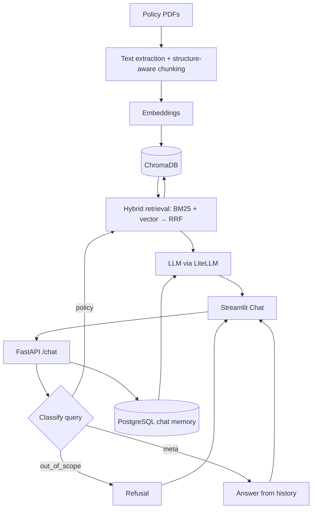

# Aria - Company Policy RAG Chatbot

Aria is an internal chatbot that answers employee questions from uploaded company
policy documents. It ingests PDF files, chunks them with document structure in
mind, stores them in ChromaDB, retrieves relevant policy context with a hybrid
(keyword + semantic) search, and asks an LLM to answer **only** from that context.

This project is intentionally demo-friendly: no auth, no accounts, no admin
setup. Drop policy PDFs in the docs folder, run the offline indexer once, and
ask questions.

## Tech Stack

| Component | Technology |
|-----------|------------|
| LLM | LiteLLM (provider-agnostic — Gemini, OpenAI, Groq, Anthropic, …) |
| Backend | FastAPI |
| Vector DB | ChromaDB (cosine distance, via `langchain-chroma`) |
| Hybrid retrieval | BM25 (`rank_bm25`) + vector search, fused with Reciprocal Rank Fusion |
| Embeddings | Sentence Transformers (`all-MiniLM-L6-v2`, via `langchain-huggingface`) |
| Chunking | Structure-aware (`langchain-text-splitters`) |
| Chat Memory | PostgreSQL (with rolling summarization) |
| PDF parsing | `pypdf` |
| Frontend | Streamlit |

The LLM layer uses [LiteLLM](https://docs.litellm.ai/docs/providers), so the model
is swappable through env vars — no code changes. Set `MODEL_NAME` to any
`provider/model_id` and supply the matching API key.

## How It Works

1. Place `.pdf` policy files in `backend/data/docs/`.
2. Run the **offline indexer** once (`python -m backend.index_documents`). It:
   - extracts text per page with `pypdf`,
   - auto-detects table-of-contents pages and uses them to drive
     **structure-aware chunking** (splitting on section headings, folding short
     heading/intro blurbs into the following section, with a graceful fallback to
     recursive splitting for unstructured PDFs),
   - embeds each chunk and stores it in ChromaDB. Unchanged files are skipped
     via a content hash; bump `CHUNK_VERSION` to force a rebuild.

   Indexing is offline-only: the running API server reads the prebuilt index and
   never ingests PDFs at request time.
3. Each incoming question is first **classified** by a small router model into
   one of three routes:
   - `policy` → run hybrid retrieval and answer from the retrieved context,
   - `meta` → answer from the conversation history only (e.g. "what did we
     discuss?"),
   - `out_of_scope` → politely refuse (general knowledge, content generation,
     etc.).
4. For `policy` queries, **hybrid retrieval** runs BM25 keyword search and
   vector similarity search in parallel, then fuses the rankings with
   Reciprocal Rank Fusion (RRF) to pick the top chunks. BM25 tokens are
   plural-normalized (so "leaves" matches "leave") and low-scoring keyword
   candidates are floored out to keep generic-token noise from polluting results.
5. The LLM answers using the retrieved policy context plus recent session
   history. The system prompt constrains it to the provided context and a
   refusal guardrail.
6. Conversation history is persisted in PostgreSQL per session. When history
   exceeds a token budget, older messages are summarized and pruned.


```mermaid
flowchart TD
    A[Policy PDFs] --> B[Text extraction + structure-aware chunking]
    B --> C[Embeddings]
    C --> D[(ChromaDB)]

    E[Streamlit Chat] --> F[FastAPI /chat]
    F --> R{Classify query}
    R -->|out_of_scope| X[Refusal]
    R -->|meta| M[Answer from history]
    R -->|policy| H[Hybrid retrieval: BM25 + vector → RRF]
    H --> D
    D --> H
    F --> P[(PostgreSQL chat memory)]
    H --> L[LLM via LiteLLM]
    P --> L
    L --> E
    M --> E
    X --> E
```

## Setup

```bash
pip install -r requirements.txt
```

Create a local PostgreSQL database for short-term chat memory:

```bash
# If PostgreSQL is not installed on macOS:
brew install postgresql@16
brew services start postgresql@16

createdb company_chatbot
```

Create `backend/.env` (see `backend/.env.example`). Only set the API key for the
provider you actually use:

```ini
# Pick one provider's key + matching MODEL_NAME
GEMINI_API_KEY=your_key_here
MODEL_NAME=gemini/gemini-2.5-flash
ROUTER_MODEL_NAME=gemini/gemini-2.5-flash-lite
LLM_TIMEOUT_SECONDS=45

# PostgreSQL short-term chat memory
DATABASE_URL=postgresql://localhost:5432/company_chatbot
MAX_HISTORY_TOKENS=2000

# Embeddings
EMBEDDING_MODEL_NAME=all-MiniLM-L6-v2
EMBEDDINGS_LOCAL_ONLY=true

# Retrieval tuning
RETRIEVAL_TOP_K=3
RRF_K_CONSTANT=60
BM25_CANDIDATE_POOL=10
EXPAND_SECTION_RETRIEVAL=false

# Paths (relative to backend/)
DOCS_PATH=./data/docs
CHROMA_DB_PATH=./data/chroma_db
SYSTEM_PROMPT_PATH=../docs/system_prompt.txt
```

> Any [LiteLLM provider](https://docs.litellm.ai/docs/providers) works — e.g.
> `MODEL_NAME=groq/llama-3.3-70b-versatile` with `GROQ_API_KEY`, or
> `openai/gpt-4o` with `OPENAI_API_KEY`. `ROUTER_MODEL_NAME` is the small,
> cheap model used for query classification; omit it to reuse `MODEL_NAME`.

Run the app:

```bash
# One command (starts backend + frontend)
./start.sh

# …or run them separately:
# Terminal 1
cd backend
python main.py

# Terminal 2
cd frontend
streamlit run app.py
```

- Frontend: http://localhost:8501
- API docs: http://localhost:8000/docs
- Health check: http://localhost:8000/health

## Configuration Reference

| Variable | Default | Purpose |
|----------|---------|---------|
| `MODEL_NAME` | `gemini/gemini-3.5-flash` | Main answering model (`provider/model_id`) |
| `ROUTER_MODEL_NAME` | `MODEL_NAME` | Small model for query classification |
| `LLM_TIMEOUT_SECONDS` | `45` | Per-call LLM timeout |
| `DATABASE_URL` | `postgresql://localhost:5432/company_chatbot` | PostgreSQL chat memory |
| `MAX_HISTORY_TOKENS` | `2000` | Token budget before history is summarized |
| `EMBEDDING_MODEL_NAME` | `all-MiniLM-L6-v2` | Sentence-transformers embedding model |
| `EMBEDDINGS_LOCAL_ONLY` | `true` | Use only locally cached embedding weights |
| `RETRIEVAL_TOP_K` | `6` | Number of chunks passed to the LLM |
| `RRF_K_CONSTANT` | `60` | Reciprocal Rank Fusion smoothing constant |
| `BM25_CANDIDATE_POOL` | `10` | Candidate pool size per retriever before fusion |
| `EXPAND_SECTION_RETRIEVAL` | `false` | Pull in sibling chunks from the same section |

## Demo Flow

1. Add policy PDFs to `backend/data/docs/` and run `python -m backend.index_documents`.
2. Open the Streamlit app (the sidebar lists the indexed documents).
3. Ask grounded questions such as:
   - "How many days of PTO do employees get?"
   - "What is the remote work policy?"
   - "How does bereavement leave work?"
4. Turn on **Show retrieved context** to see the RAG evidence behind the answer.
5. Ask an out-of-scope question such as "What is the capital of France?" to see
   the bot refuse rather than invent an answer.

## API

| Method | Endpoint | Description |
|--------|----------|-------------|
| `POST` | `/chat` | Ask a question and receive an answer with context and sources |
| `GET` | `/chat/documents` | List the PDF policy files in the indexed corpus |
| `GET` | `/chat/history/{session_id}` | Get persisted session chat history |
| `DELETE` | `/chat/history/{session_id}` | Clear persisted session chat history |

## Notes

- Indexing is offline-only via `python -m backend.index_documents`. Changed
  files are re-indexed based on a content hash, and a rebuild is also triggered
  when `CHUNK_VERSION` changes. `start.sh` runs the indexer once if no index
  exists yet.
- ChromaDB data and policy documents are ignored by git.
- This is a local demo app with no auth by design.
