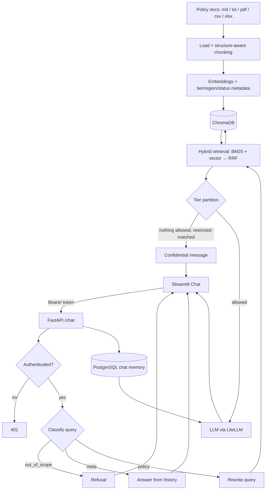

# Aria — Company Policy RAG Chatbot

Aria is an internal chatbot that answers employee questions from company policy
documents. It ingests a department-organized, multi-format corpus
(`.md` / `.txt` / `.pdf` / `.csv` / `.xlsx`), chunks it with document structure in
mind, stores it in ChromaDB, retrieves relevant context with hybrid
(keyword + semantic) search, and asks an LLM to answer **only** from that context
— gated by the user's **role and region** so restricted documents never leak.

This repository is the `app-base` line: a working local RAG pipeline (FastAPI +
Streamlit + PostgreSQL + ChromaDB) with **JWT auth + 3-tier RBAC + region
filtering**. It is the foundation for a larger serverless build-out — see
[`PROGRESS.md`](PROGRESS.md) for the full direction and step-by-step status.

## Tech Stack

| Component | Technology |
|-----------|------------|
| LLM | LiteLLM (provider-agnostic — Groq, Gemini, OpenAI, Anthropic, …) |
| Backend | FastAPI |
| Auth | JWT (PyJWT, HS256) + bcrypt; 3-tier RBAC (employee / manager / HR) + per-user region (US / India) |
| Frontend | Streamlit (throwaway; a React frontend is planned) |
| Vector DB | ChromaDB (cosine distance, via `langchain-chroma`) |
| Hybrid retrieval | BM25 (`rank_bm25`) + vector search, fused with Reciprocal Rank Fusion |
| Embeddings | Sentence Transformers (`all-MiniLM-L6-v2`, via `langchain-huggingface`) |
| Chunking | Structure-aware (markdown headings / TOC); tabular rows-as-chunks |
| Chat Memory | PostgreSQL (with rolling summarization) |
| Document loading | `pypdf` (PDF) · markdown/txt frontmatter · CSV/XLSX (`openpyxl`) via `.meta.yaml` sidecar |

The LLM layer uses [LiteLLM](https://docs.litellm.ai/docs/providers), so the model
is swappable through env vars — no code changes. Set `MODEL_NAME` to any
`provider/model_id` and supply the matching API key.

## Policy Corpus

The corpus lives under `backend/data/docs/` as **department subfolders**
(`hr/`, `finance/`, `it/`, `time-and-leave/`, `benefits/`, `legal-compliance/`,
`people-career/`) — ~30 documents spanning `.md` / `.txt` / `.pdf` / `.csv` /
`.xlsx`. The company is the fictional **GSVH Corp** (US parent + GSVH India Pvt
Ltd).

Every `.md`/`.txt` document declares its own metadata in frontmatter; tabular and
PDF files carry a companion `<name>.meta.yaml` sidecar instead:

```markdown
---
department: hr
access_tier: all          # all | manager | hr_only
region: global            # global | us | india
doc_type: policy          # policy | procedure | handbook | faq | reference_table
version: 2026.1
effective_date: 2026-01-01
status: active            # active | superseded (superseded docs are excluded)
title: Employment Basics
---
```

Retrieval is filtered on three axes:

- **`access_tier` (RBAC):** employee → `all`; manager → `all` + `manager`;
  HR → `all` + `manager` + `hr_only`. The tier gate is enforced as a single
  app-layer partition in the retriever (region + status stay as Chroma filters),
  so a blocked chunk's text never reaches the LLM.
- **`region`:** `global` docs are visible to everyone; `us`/`india` docs only to
  users of that region.
- **`status`:** `superseded` documents (e.g. the prior-year leave policy) are
  never surfaced.

When a question's only relevant matches are above the caller's tier, the bot
returns a graceful **"that's confidential — contact HR / your manager"** message
instead of a generic miss.

## How It Works

1. Add policy documents under `backend/data/docs/<department>/`
   (`.md`/`.txt`/`.pdf`/`.csv`/`.xlsx`; tabular + PDF carry a `.meta.yaml` sidecar).
2. Run the **offline indexer** once (`python -m backend.index_documents`). It:
   - loads each file (pypdf per-page for PDF; markdown/txt with frontmatter
     stripped; CSV/XLSX serialized one-row-per-chunk), walking subfolders
     recursively,
   - applies **structure-aware chunking** (markdown docs split on `##`+ headings;
     PDFs on detected TOC/section headings; tiny intro blurbs folded forward; the
     leading title/overview block tagged `overview` and excluded; tabular rows
     passed through verbatim as `reference_table`),
   - embeds each chunk and stores it in ChromaDB with `department`,
     `access_tier`, `region`, `doc_type`, `version`, `status` metadata. Unchanged
     files are skipped via a content hash; bump `CHUNK_VERSION` to force a rebuild.

   Indexing is offline-only: the running API reads the prebuilt index and never
   ingests documents at request time. **HR can trigger a reindex** via
   `POST /admin/reindex`. (After a CLI reindex, restart the server — it caches the
   Chroma handle + BM25 index in memory.)
3. Every request requires a **bearer token** (`POST /auth/login`). The user's
   role + region determine which documents are retrievable.
4. Each question is **classified** by a small router model:
   - `policy` → hybrid retrieval (tier + region filtered) and answer from context,
   - `meta` → answer from conversation history only,
   - `out_of_scope` → refuse (general knowledge, content generation, etc.).
5. For `policy` queries, the message is **rewritten into a standalone search
   query** (history-aware), then **hybrid retrieval** runs BM25 + vector search,
   fused with Reciprocal Rank Fusion. The retriever partitions candidates by the
   caller's tiers; if nothing allowed matches but a restricted doc does, it
   returns the confidential message.
6. The LLM answers from the retrieved context + recent history, constrained by
   the system prompt and a refusal guardrail (cites only documents in context).
7. Conversation history is persisted in PostgreSQL per session; when it exceeds a
   token budget, older messages are summarized and pruned.


```mermaid
flowchart TD
    A[Policy docs: md / txt / pdf / csv / xlsx] --> B[Load + structure-aware chunking]
    B --> C[Embeddings + tier/region/status metadata]
    C --> D[(ChromaDB)]

    E[Streamlit Chat] -->|Bearer token| F[FastAPI /chat]
    F --> G{Authenticated?}
    G -->|no| U[401]
    G -->|yes| R{Classify query}
    R -->|out_of_scope| X[Refusal]
    R -->|meta| M[Answer from history]
    R -->|policy| Q[Rewrite query] --> H[Hybrid retrieval: BM25 + vector → RRF]
    H --> D
    D --> H
    H --> PT{Tier partition}
    PT -->|nothing allowed, restricted matched| CF[Confidential message]
    PT -->|allowed| L[LLM via LiteLLM]
    F --> P[(PostgreSQL chat memory)]
    P --> L
    L --> E
    M --> E
    X --> E
    CF --> E
```

## Setup

```bash
pip install -r requirements.txt
```

Create a local PostgreSQL database (chat memory + users):

```bash
# If PostgreSQL is not installed on macOS:
brew install postgresql@16
brew services start postgresql@16

createdb company_chatbot
```

Create `backend/.env` from the template (`backend/.env.example` is the source of
truth). At minimum set a provider key + `MODEL_NAME`, and a `JWT_SECRET` (the
server refuses to boot without it):

```ini
# Pick one provider's key + matching MODEL_NAME
GEMINI_API_KEY=your_key_here
MODEL_NAME=gemini/gemini-2.5-flash
ROUTER_MODEL_NAME=gemini/gemini-2.5-flash-lite
LLM_TIMEOUT_SECONDS=45

# PostgreSQL (chat memory + users)
DATABASE_URL=postgresql://localhost:5432/company_chatbot
MAX_HISTORY_TOKENS=2000

# Auth (required) — generate: python -c "import secrets; print(secrets.token_urlsafe(48))"
JWT_SECRET=your_long_random_secret
JWT_EXPIRY_HOURS=8

# Retrieval tuning
RETRIEVAL_TOP_K=6
BM25_CANDIDATE_POOL=10
RETRIEVAL_STRATEGY=hybrid       # vector | bm25 | hybrid
RETRIEVAL_MAX_DISTANCE=0.8      # cosine-distance floor for vector hits
QUERY_REWRITE_ENABLED=true      # history-aware follow-up rewriting
```

Seed user accounts (passwords from env, never hardcoded), build the index, run:

```bash
# Seed HR + manager + 2 employees (employee2 is region=india)
SEED_HR_PASSWORD='Test1234!' SEED_MANAGER_PASSWORD='Test1234!' \
SEED_EMPLOYEE_PASSWORD='Test1234!' SEED_EMPLOYEE2_PASSWORD='Test1234!' \
python -m backend.seed_users

# Build the vector index once (and again when docs or chunking logic change)
python -m backend.index_documents

# One command (starts backend + frontend)
./start.sh
```

- Frontend: http://localhost:8501 (log in first)
- API docs: http://localhost:8000/docs
- Health check: http://localhost:8000/health

Seeded accounts (all password `Test1234!`): `hr@gsvh.test` (hr, us),
`manager@gsvh.test` (manager, us), `employee@gsvh.test` (employee, us),
`employee2@gsvh.test` (employee, india).

## Configuration Reference

| Variable | Default | Purpose |
|----------|---------|---------|
| `MODEL_NAME` | `groq/llama-3.3-70b-versatile` | Main answering model (`provider/model_id`) |
| `ROUTER_MODEL_NAME` | `groq/llama-3.1-8b-instant` | Small model for classification + query rewriting |
| `LLM_TIMEOUT_SECONDS` | `45` | Per-call LLM timeout |
| `DATABASE_URL` | `postgresql://localhost:5432/company_chatbot` | PostgreSQL (chat memory + users) |
| `MAX_HISTORY_TOKENS` | `2000` | Token budget before history is summarized |
| `JWT_SECRET` | *(required)* | HS256 signing secret; server refuses to boot if unset |
| `JWT_EXPIRY_HOURS` | `8` | Access-token lifetime |
| `EMBEDDING_MODEL_NAME` | `all-MiniLM-L6-v2` | Sentence-transformers embedding model |
| `EMBEDDINGS_LOCAL_ONLY` | `true` | Use only locally cached embedding weights |
| `RETRIEVAL_STRATEGY` | `hybrid` | `vector`, `bm25`, or `hybrid` |
| `RETRIEVAL_TOP_K` | `6` | Number of chunks passed to the LLM |
| `RETRIEVAL_MAX_DISTANCE` | `0.8` | Cosine-distance floor; vector hits beyond it are dropped |
| `RRF_K_CONSTANT` | `60` | Reciprocal Rank Fusion smoothing constant |
| `BM25_CANDIDATE_POOL` | `10` | Candidate pool size per retriever before fusion |
| `QUERY_REWRITE_ENABLED` | `true` | History-aware query rewriting before retrieval |

## Demo Flow

1. Seed users + build the index (see Setup), then `./start.sh`.
2. Open the Streamlit app and **log in** (e.g. `hr@gsvh.test` / `Test1234!`).
3. Ask grounded questions:
   - "How many PTO days do I get after 5 years?" (24 — tenure-banded, current policy)
   - "What's the 401(k) match?" (4% — US benefits PDF)
   - "I clicked a suspicious link and lost my laptop — what do I do?"
4. **RBAC + region in action:** as an **employee**, ask "what are the L5 salary
   bands?" → restricted (HR-only) so you get the confidential message, not the
   numbers. Log in as **HR** → you get the bands. As `employee2@gsvh.test` (India)
   ask "what's the EPF contribution?" → 12%; the same user gets no US-only 401(k).
5. Only **HR** sees the "Update policies (reindex)" button.
6. Ask "What is the capital of France?" to see the bot refuse rather than invent.

## API

All routes except `/health` and `/auth/login` require `Authorization: Bearer <token>`.

| Method | Endpoint | Auth | Description |
|--------|----------|------|-------------|
| `POST` | `/auth/login` | none | Exchange email + password for a JWT |
| `GET` | `/auth/me` | any user | Current user `{id, role, region}` |
| `POST` | `/chat` | any user | Ask a question; returns answer + context + sources (tier + region filtered) |
| `GET` | `/chat/documents` | any user | List the policy files in the indexed corpus |
| `GET` | `/chat/documents/{filename}/download` | any user | Download a source document |
| `GET` | `/chat/history/{session_id}` | any user | Get persisted session chat history |
| `DELETE` | `/chat/history/{session_id}` | any user | Clear persisted session chat history |
| `POST` | `/admin/reindex` | HR only | Rebuild the vector index from the corpus |
| `GET` | `/health` | none | Liveness check |

## Evaluation

Evaluation is **offline and dev-only** — it never runs on the request path. The
harness in `backend/eval/` scores the pipeline against a labeled dataset:
retrieval metrics (`recall@k`, `hit@k`, `mrr`, `context_hit_rate`) with no LLM,
plus RAGAS answer-quality metrics in an isolated virtualenv. See
[`backend/eval/README.md`](backend/eval/README.md).

> Note: the labeled dataset still targets the previous corpus and is being
> regenerated for the expanded GSVH department corpus as part of the
> retrieval-quality step.

## Project Direction

`app-base` is local + multi-user with auth. The serverless build-out is tracked
step-by-step in [`PROGRESS.md`](PROGRESS.md). In short:

0. Multi-source, multi-format corpus + ingestion — ✅
1. JWT auth + 3-tier RBAC + region filtering — ✅
2. Security & resilience (prompt-injection, rate limiting, graceful LLM errors)
3. User preferences in PostgreSQL
4. Retrieval-quality inspection (eval harness; structural fixes already in)
5. Observability (response envelope, telemetry, metrics)
6. Admin document lifecycle (upload / status / delete / reindex)
7. React frontend
8. pgvector migration + Cloud Run deploy
9. Background workers / event-based ingestion

## Notes

- Indexing is offline-only via `python -m backend.index_documents`; HR can also
  trigger it through `POST /admin/reindex`. Changed files are re-indexed by
  content hash, and a rebuild is forced when `CHUNK_VERSION` changes. Restart the
  server after a CLI reindex (in-memory Chroma/BM25 caches).
- The policy corpus under `backend/data/docs/` **is tracked** (including corpus
  PDFs); the generated vector store (`backend/data/chroma_db/`) and the archived
  reference PDF (`backend/data/docs_archive/`) are gitignored.
- `backend/.env` is gitignored — `JWT_SECRET` and API keys are never committed.
