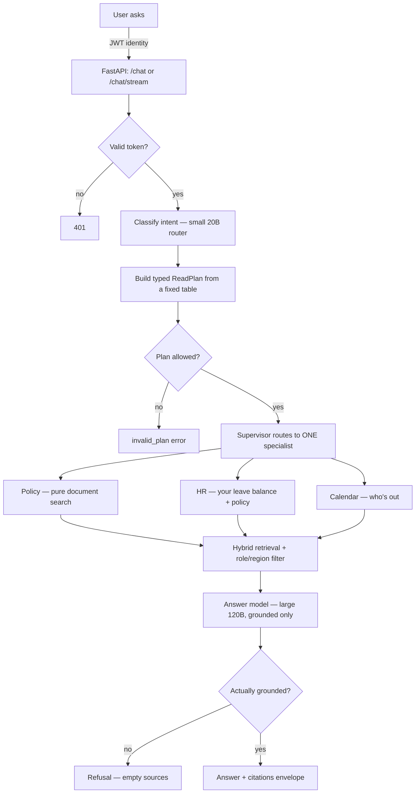
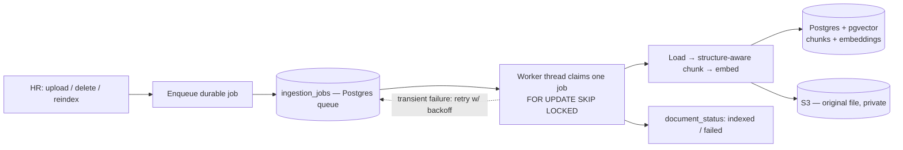

# Aria — Company Policy Assistant

Aria answers an employee's questions from internal company policy — and only from
policy the person is actually allowed to see. Ask *"how much PTO do I have left?"*
or *"who's out next week?"* and it retrieves the right documents, checks your role
and region, and answers **grounded in real evidence** with citations. If the
honest answer is "you're not cleared for that" or "I don't have a source," it says
so instead of inventing one.

It is a **read-only** assistant: it can look things up, but it never changes
company data (no booking leave, no editing calendars). That restraint is a design
choice — everything is bounded, traceable, and explainable.

---

## What it does

- **Answers from documents, not memory.** Every reply is built from retrieved
  policy text; nothing is made up. No source → it refuses.
- **Respects who's asking.** Role (employee / manager / HR) and region (US / India)
  decide which documents you can see. A restricted doc's text never even reaches
  the model when you're not cleared.
- **Three specialists, one router.** A cheap classifier reads your question and
  hands it to exactly one specialist: **Policy**, **HR** (your own leave balance),
  or **Calendar** (who's out).
- **Streams or returns whole.** Same logic behind both `/chat` (one response) and
  `/chat/stream` (token-by-token).
- **Remembers the conversation.** Per-user chat sessions with rolling
  summarization so long chats stay cheap.
- **HR can manage the corpus.** Upload / delete / reindex documents; ingestion runs
  as a durable background job.

---

## How a question flows


```mermaid
flowchart TD
    U[User asks] -->|JWT identity| API[FastAPI: /chat or /chat/stream]
    API --> AUTH{Valid token?}
    AUTH -->|no| E401[401]
    AUTH -->|yes| CL[Classify intent — small 20B router]
    CL --> PLAN[Build typed ReadPlan from a fixed table]
    PLAN --> VAL{Plan allowed?}
    VAL -->|no| ERR[invalid_plan error]
    VAL -->|yes| SUP[Supervisor routes to ONE specialist]
    SUP --> POL[Policy — pure document search]
    SUP --> HRS[HR — your leave balance + policy]
    SUP --> CAL[Calendar — who's out]
    POL --> RET[Hybrid retrieval + role/region filter]
    HRS --> RET
    CAL --> RET
    RET --> ANS[Answer model — large 120B, grounded only]
    ANS --> GUARD{Actually grounded?}
    GUARD -->|no| REF[Refusal — empty sources]
    GUARD -->|yes| OUT[Answer + citations envelope]
```

**The control layer is deterministic.** The model *classifies* and *writes*, but it
never picks the plan. Intent → a **fixed table** → a typed `ReadPlan` → validated
against hard budgets → one specialist. Every hop emits a redacted trace so you can
see the boundaries without leaking document text or identities.

**Why two models.** A small **20B** router runs on every message (classify,
rewrite the query, pick a tool) — fast and cheap. The large **120B** runs once, for
the one job that needs reasoning: writing the grounded answer. Both are swappable
by env var (LiteLLM), so the provider is not baked in.

---

## Who sees what (RBAC + region)

Every document self-describes its `access_tier`, `region`, and `status`. Retrieval
filters on all three:

| Axis | Rule |
|---|---|
| **access_tier** | employee → `all`; manager → `all`+`manager`; HR → everything |
| **region** | `global` visible to all; `us` / `india` docs only to that region |
| **status** | `superseded` docs (last year's policy) are never surfaced |

The tier check is the security boundary. It happens **in application code, before a
restricted chunk is ever formatted into a prompt** — not as a model instruction a
clever question could talk its way past. If the only matches are above your tier,
you get a polite *"that's confidential — contact HR"*, not the numbers.

---

## The specialists

One supervisor delegates to exactly one specialist per request — no fan-out, no
specialist calling another.

| Specialist | Answers | Backed by |
|---|---|---|
| **Policy** | Any policy question | Document retrieval only |
| **HR** | *Your own* leave balance, fused with policy | `HRISClient` (mocked HR system) + retrieval |
| **Calendar** | Who's out over a date range | `CalendarClient` (mocked calendar) + retrieval |

Two rules keep this safe:
- **Identity comes from your token, never from the question.** The HR tool is called
  with the *server's* idea of who you are, so Bob can never read Alice's balance by
  asking nicely.
- **Tools are read-only and isolated.** Each specialist can reach only its own tool
  (HR can't touch the calendar tool, and vice-versa). A master switch
  (`AGENT_TOOLS_ENABLED=false`) turns every tool off and falls back to pure document
  search.

---

## Retrieval, briefly

Two searches run in parallel and get merged:

- **Semantic** — the question is embedded (local MiniLM model) and matched by
  meaning against the vector index.
- **Keyword** — BM25 catches exact terms the semantic search might miss.

Their rankings are fused with **RRF** (Reciprocal Rank Fusion — a simple
"agreed-on by both lists ranks higher" formula). The merged top results, after the
role/region/status filter, become the evidence the answer model is allowed to use.

---

## Ingestion — how documents get in

HR uploads, deletes, or reindexes. The request returns immediately; the real work
is a **durable job** so nothing is lost if the server restarts mid-processing.


```mermaid
flowchart LR
    HR[HR: upload / delete / reindex] --> ENQ[Enqueue durable job]
    ENQ --> Q[(ingestion_jobs — Postgres queue)]
    Q --> W[Worker thread claims one job<br/>FOR UPDATE SKIP LOCKED]
    W --> P[Load → structure-aware chunk → embed]
    P --> PGV[(Postgres + pgvector<br/>chunks + embeddings)]
    P --> S3[(S3 — original file, private)]
    W --> ST[document_status: indexed / failed]
    W -.->|transient failure: retry w/ backoff| Q
```

- **Durable + crash-safe.** The job lives in Postgres. If the worker dies mid-embed,
  the job is reclaimed after its lease expires and re-run — no stuck documents, no
  lost work.
- **Idempotent.** Re-running a job replaces the document atomically; duplicate
  delivery never creates duplicate chunks, and a failed run never corrupts the live
  version being served.
- **Originals kept privately.** The raw uploaded file is stored in **S3** (encrypted,
  no public access), keyed per document version — the searchable chunks live in
  Postgres, the source-of-truth file lives in S3.
- **Retries then gives up cleanly.** Transient errors back off and retry a few times;
  a genuinely bad document ends as `failed` in the admin list, re-uploadable.

---

## Where data lives

Everything the *assistant* owns is in Postgres. Everything that's the *business's*
truth (leave balances, calendars) stays behind mocked interfaces and is never
copied here.

| Store | Holds |
|---|---|
| **Postgres** | users · refresh tokens · chat sessions + messages · preferences · document status · **documents / document_versions / chunks** (with `vector(384)` embeddings) · **ingestion_jobs** queue |
| **S3** | original uploaded files (private, encrypted, keyed by version) |
| **In-memory** | the BM25 keyword index — a derived cache, rebuilt from the chunk table |

The rule: the app owns the assistant's state; it never persists the company's
actual HR/calendar truth.

---

## Security invariants

- **Identity from the JWT only** — any `user_id`/`email` in model output is ignored.
- **Tier filter before formatting** — restricted text can't reach the model.
- **No write tools exist anywhere** — read-only by construction.
- **Prompt-injection defense in depth** — fixed system rules + a per-request nonced
  fence around retrieved text; a document can *request* a tool call but never
  *authorize* one.
- **SQL always parameterized**; sessions are owner-checked (you touch only your own).
- **Traces redact** — logs carry ids and scores, never document bodies, emails, or
  tokens.

---

## Tech stack

| Layer | Choice |
|---|---|
| Backend | FastAPI (sync `/chat` + SSE `/chat/stream` share one pipeline) |
| LLM gateway | LiteLLM — provider-agnostic (default Groq `gpt-oss-120b` / `gpt-oss-20b`) |
| Vector store | PostgreSQL + **pgvector** (cosine, HNSW index) |
| Keyword search | BM25 (`rank-bm25`), fused via RRF |
| Embeddings | Sentence-Transformers `all-MiniLM-L6-v2` (local, 384-dim) |
| Object storage | AWS S3 (originals) behind a swappable `ObjectStore` seam |
| Auth | JWT (HS256) + bcrypt; short access token + rotating refresh cookie; 3-tier RBAC + region |
| Frontend | React (Vite + TanStack Query) — chat, SSE, sessions, prefs, HR doc portal, dark mode |
| Ingestion | Durable Postgres job queue + in-process worker |

---

## Run it

```bash
python -m venv venv && source venv/bin/activate
pip install -r requirements.txt

# Postgres + pgvector
brew install postgresql@16 pgvector && brew services start postgresql@16
createdb company_chatbot

# backend/.env — copy the template, set a provider key + JWT_SECRET (+ S3 creds)
cp backend/.env.example backend/.env

# Seed users, build the index once, start everything
python -m backend.seed_users        # needs SEED_*_PASSWORD env vars
python -m backend.index_documents   # re-run when docs or chunking change
./start.sh
```

Seeded accounts (password `Test1234!`): `hr@gsvh.test` (HR, US),
`manager@gsvh.test`, `employee@gsvh.test`, `employee2@gsvh.test` (India).

- Frontend: http://localhost:5173 · API docs: http://localhost:8000/docs

**Key config** (full list in `backend/.env.example`):

| Var | Default | Purpose |
|---|---|---|
| `MODEL_NAME` | `groq/openai/gpt-oss-120b` | large answer model |
| `ROUTER_MODEL_NAME` | `groq/openai/gpt-oss-20b` | classify / rewrite / tool-select |
| `AGENT_TOOLS_ENABLED` | `false` | master tool switch (off = pure RAG) |
| `JWT_SECRET` | *(required)* | refuses to boot without it |
| `DATABASE_URL` | `postgresql://localhost:5432/company_chatbot` | Postgres |
| `S3_BUCKET` / `S3_REGION` | *(set for originals)* | private object store |
| `RETRIEVAL_STRATEGY` / `RETRIEVAL_TOP_K` | `hybrid` / `6` | retrieval |

---

## API surface

Protected routes need `Authorization: Bearer <access_token>`. The full typed
contract is frozen at [`docs/api/openapi.json`](docs/api/openapi.json) (live at `/docs`).

| Group | Endpoints |
|---|---|
| **Auth** | `POST /auth/login` · `POST /auth/refresh` · `POST /auth/logout` · `GET /auth/me` |
| **Chat** | `POST /chat` · `POST /chat/stream` · `GET/POST /chat/sessions` · `PATCH/DELETE /chat/sessions/{id}` · `GET/DELETE /chat/history/{id}` |
| **Me** | `GET/PUT /me/preferences` |
| **Admin (HR)** | `POST /admin/documents/upload` · `GET /admin/documents` · `GET /admin/documents/{id}/status` · `DELETE /admin/documents/{id}` · `POST /admin/reindex` |
| **Ops** | `GET /health` |

**Response envelope** (`/chat` and the SSE `done` event):

```json
{
  "answer": "Full-time employees accrue 20, 24, or 28 PTO days by tenure…",
  "sources": [{ "document_id": "time-and-leave/working-hours-and-pto.md", "section": "PTO", "source_type": "all" }],
  "latency_ms": 1840,
  "session_id": "abc-123",
  "status": "ok"
}
```

`status ∈ {ok, no_results, blocked, refused, partial}`. Errors use a uniform
`{"error": {"code", "message", "detail"}}` body.

---

## Evaluation

Offline and dev-only — never on the request path. `backend/eval/` scores retrieval
(`recall@k`, `mrr`, `hit@k`) with no LLM, plus RAGAS answer-quality in an isolated
venv. Baseline: hybrid beats vector-only and keyword-only; the weakest spot is
cross-document questions.
