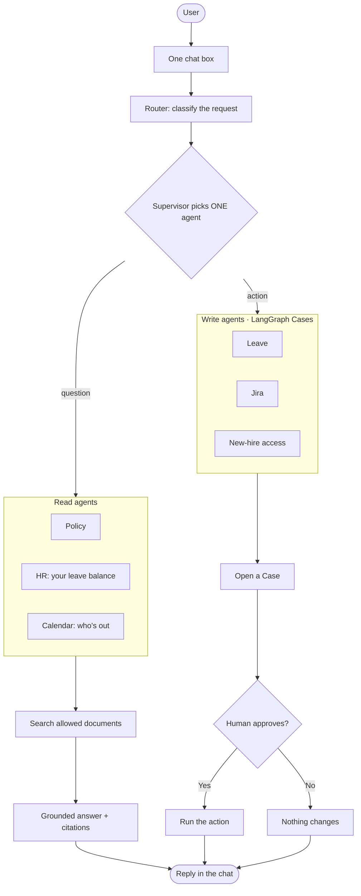

# Aria — Controlled Multi-Agent Company Assistant

Aria is an internal company assistant you use from **one chat box**. Behind that box is a
**multi-agent system**: a deterministic supervisor routes each request to exactly one
specialist agent, and actions that change company data run as **LangGraph workflows** that
pause for human approval.

- **Ask** a policy question — *"How much PTO do I have left?"*, *"Who's out next week?"* —
  and a read specialist answers from the real company documents you're allowed to see, with
  citations. No source or not cleared → it says so instead of guessing.
- **Ask it to do something** — *"Book me two days off"*, *"File a Jira for the redesign"*,
  *"Set up my access, I'm a new backend engineer"* — and a write agent opens an
  approval-gated request. Nothing changes company data until a human signs off in the chat.

The chat is the whole product: questions and actions both start in the same place.

---

## What it can do

| | |
|---|---|
| 💬 **Answer from documents** | Grounded replies with citations — never made up. No source, no answer. |
| 🔒 **Respect who's asking** | You only see documents your role and region allow. |
| ✅ **Take actions, safely** | Book leave, file a Jira, grant new-hire access — each a LangGraph Case gated on human approval. |
| 🧵 **Remember the conversation** | Per-user chat sessions with rolling summaries so long chats stay cheap. |
| 📥 **Let HR manage the corpus** | Upload, delete, and re-index policy documents as a background job. |

---

## Architecture

A small, fast **router** classifies each message, then a **deterministic supervisor** sends
it to exactly one agent — never a free-for-all, never one agent calling another. The AI
classifies the request and writes the wording; it never decides *what action to take* or
*which agent runs* — a fixed table does that. A human is always in the loop before any write.

**Read agents** answer questions. **Write agents** take actions, and each one runs as a
**LangGraph Case**: a typed, checkpointed workflow that **pauses at an interrupt** to wait
for a human's Approve/Deny and **resumes exactly where it left off** — surviving a server
restart, never running the same action twice.


```mermaid
flowchart TB
    User([User]) --> Chat[One chat box]
    Chat --> Router[Router: classify the request]
    Router --> Supervisor{Supervisor picks ONE agent}

    Supervisor -->|question| Reads
    Supervisor -->|action| Writes

    subgraph Reads [Read agents]
        direction LR
        Policy[Policy]
        HR[HR: your leave balance]
        Calendar[Calendar: who's out]
    end

    subgraph Writes [Write agents · LangGraph Cases]
        direction LR
        Leave[Leave]
        Jira[Jira]
        Onboarding[New-hire access]
    end

    Reads --> Retrieve[Search allowed documents] --> Answer[Grounded answer + citations]

    Writes --> Case[Open a Case] --> Approve{Human approves?}
    Approve -->|Yes| Act[Run the action]
    Approve -->|No| Skip[Nothing changes]

    Answer --> Reply([Reply in the chat])
    Act --> Reply
    Skip --> Reply
```

### Read agents

One supervisor delegates to exactly one specialist per request; each reaches only its own tool.

| Agent | Answers | Backed by |
|---|---|---|
| **Policy** | Any policy question | Document search only |
| **HR** | *Your own* leave balance, plus policy | HR system (mock) + search |
| **Calendar** | Who's out over a date range | Calendar (mock) + search |

Questions are answered by merging semantic (pgvector) and keyword (BM25) search, filtered to
what you're allowed to see, then written up by a model that may only use the retrieved text.

### Write agents

Each runs as a LangGraph Case with a clear lifecycle — *submitted → waiting for approval →
done* (or *denied*) — an audit trail, and a shared reliability boundary (retries, circuit
breaker, dead-letter queue) so a flaky downstream system never loses or double-runs an action.

| Agent | Action | Downstream (mock) |
|---|---|---|
| **Leave** | Book time off | HR system |
| **Jira** | File an issue in the right project | Jira |
| **New-hire access** | Grant a role's access bundle | Access provisioner |

---

## Security, in short

- **Identity comes from your login, never from the chat.** You can't act as someone else by
  asking nicely, and the approver is decided by the system, not the requester.
- **You only see what your role and region permit** — restricted text never even reaches the
  model when you're not cleared for it.
- **No action happens without human approval**, and every action is logged.
- **The control path has no AI in it** — routing, approval, and retries are plain, testable code.

---

## Tech stack

| Layer | Choice |
|---|---|
| Backend | FastAPI (regular + streaming chat) |
| Frontend | React (Vite + TanStack Query) |
| Multi-agent | Deterministic supervisor + scoped specialist agents (hand-rolled) |
| Action workflows | **LangGraph** — typed Cases, checkpointing, interrupt/resume |
| AI gateway | LiteLLM — provider-agnostic (default Groq models) |
| Search | PostgreSQL + pgvector (semantic) and BM25 (keyword), merged |
| Embeddings | Sentence-Transformers `all-MiniLM-L6-v2` (local) |
| Storage | PostgreSQL (app data) + AWS S3 (original files) |
| Auth | JWT + bcrypt, 3-tier role-based access + region |

The external systems Aria acts on (HR, Jira, calendar, access provisioning) are **mocked
behind clean interfaces**, so plugging in the real ones later doesn't touch the rest of the app.

---

## Run it locally

```bash
python -m venv venv && source venv/bin/activate
pip install -r requirements.txt

# PostgreSQL + pgvector
brew install postgresql@16 pgvector && brew services start postgresql@16
createdb company_chatbot

# Configuration — copy the template, set a provider key + JWT_SECRET
cp backend/.env.example backend/.env

# Seed users, build the search index once, start everything
python -m backend.seed_users
python -m backend.index_documents
./start.sh
```

- Frontend: http://localhost:5173 · API docs: http://localhost:8000/docs
- Seeded accounts (password `Test1234!`): `hr@gsvh.test`, `manager@gsvh.test`,
  `employee@gsvh.test`, `employee2@gsvh.test`

Full configuration lives in `backend/.env.example`.

---

## API at a glance

Protected routes need `Authorization: Bearer <token>`. The full typed contract is at
[`docs/api/openapi.json`](docs/api/openapi.json) (live at `/docs`).

| Group | What it covers |
|---|---|
| **Auth** | Login, refresh, logout, current user |
| **Chat** | Send a message (sync or streaming), manage sessions and history |
| **Cases** | List action requests, view one, approve or deny |
| **Admin** | HR document management; action-queue health |

---

## Status

- **Read agents:** shipped and live.
- **Write agents:** backend complete (Leave, Jira, new-hire access) as LangGraph Cases; the
  chat UI for approving requests is next.

Everything action-related is behind feature flags — with them off, Aria behaves exactly like
the read-only assistant.
